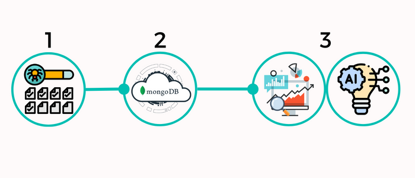

# NBA_Champion
### ➭ Predicting the last 3 (2020-2022) NBA Champions using Machine Learning.

The NBA playoffs is the postseason tournament of the National Basketball Association (NBA) held to determine the league's Champion. An annual best-of-seven elimination tournament, the NBA playoffs are held after the league's regular season and its preliminary postseason tournament, the NBA Play-In Tournament.
 I use historical data on each regular season played by a team to predict the last 3 Champions (2020-2022).
 My regression model combined with adjusted ranking metrics correctly predicted ALL 3 Champions!
 But what are the stats (features) that have allowed my model to perform so well?

The following picture shows all the work steps that are carried out. I usually combine these steps in a fully automated pipeline, but since this is a side project and my free time is limited, the pipeline is split into 3 files that are executed sequentially.

##### ➤ 1 'nba_html_crawler.ipynb':
- Parse selected Basketball-Reference (Website) pages and save all relevant pages in html-format. 
- [Basketball-Reference](https://www.basketball-reference.com/)

##### ➤ 2 'nba_html_to_mongodb.ipynb':
- Aggregate the data from the html pages and upload it to my MongoDB Cloud account.

##### ➤ 3 'nba_ml.ipynb':
- Predict the last 3 (2020-2022) NBA Champions with Machine Learning.

##### ➤ Additional 'dashboard.pbix': 
- PowerBI file with a three charts, all three are featured in the 'nba_ml.ipynb' file. 

# Article on Medium: 
[Medium](https://medium.com/@thejk/i-will-predict-the-2023-nba-champion-using-machine-learning-5e8df072059d?source=friends_link&sk=6c7a375a1b329485bb97cccfed709835) 

## 🔗 Links from the Author(Me)
[Portfolio/Website](https://thejk.de/) 
[LinkedIn](https://www.linkedin.com/in/jk05/) 
[Medium](https://medium.com/@thejk) 
[Pinterest](https://www.pinterest.de/thejk_real/)
