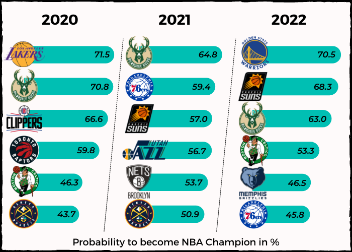
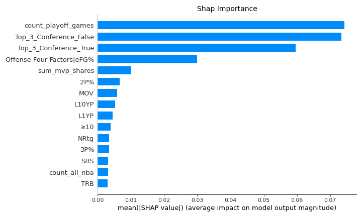

# NBA_Champion
### ➭ Predicting the last 3 (2020-2022) NBA Champions using Machine Learning.

The NBA playoffs is the postseason tournament of the National Basketball Association (NBA) held to determine the league's Champion. An annual best-of-seven elimination tournament, the NBA playoffs are held after the league's regular season and its preliminary postseason tournament, the NBA Play-In Tournament.
 I use historical data on each regular season played by a team to predict the last 3 Champions (2020-2022).
 My regression model combined with adjusted ranking metrics correctly predicted ALL 3 Champions!
 But what are the stats (features) that have allowed my model to perform so well?

The following picture shows all the work steps that are carried out. I usually combine these steps in a fully automated pipeline, but since this is a side project and my free time is limited, the pipeline is split into 3 files that are executed sequentially.

##### ➤ 1 'nba_html_crawler.ipynb':
- Parse selected Basketball-Reference (Website) pages and save all relevant pages in html-format. 
- [Basketball-Reference](https://www.basketball-reference.com/)

##### ➤ 2 'nba_html_to_mongodb.ipynb':
- Aggregate the data from the html pages and upload it to my MongoDB Cloud account.

##### ➤ 3 'nba_ml.ipynb':
- Predict the last 3 (2020-2022) NBA Champions with Machine Learning.

##### ➤ Additional 'dashboard.pbix': 
- PowerBI file with a three charts, all three are featured in the 'nba_ml.ipynb' file. 

----
## Results: 
### ➭ (For detailed information analyse the 'nba_ml.ipynb' file)  

 To my delight, I managed to predict all 3 Champions using an RandomForest regressor. I was also able to use SHAP to examine the regressor's decision-making process. The two following diagrams show the results of the detailed model investigation. Since my time is limited, just a little hint on how to interpret the plots.

#### Hint 1/2 for both images: The feature with the greatest impact on the regressor is at the top. The feature, Top_3_Coonference_True (= Did the team finish in the top 3 in their conference (East/West) in the regular season? YES ), is at the top. It follows that Top_3_Coonference_True has the biggest influence on the regressor and its prediction.

#### Hint 2/2 for the second pictures: Here the individual features are now examined exactly according to their size.

#### The RandomForest will predict a higher champion share score if...
- the feature 'Top_3_Coonference_True' have a high value = 1 -> (The team finished in the top 3)
- the feature 'count_playoff_games' have a high value. -> (The team has a roster that has played many playoff games -> a lot of experience)
- the feature 'Top_3_Coonference_False' have a low value = 0 -> (The team did not finish in the top 3)
- the feature 'sum_mvp_shares' have a high value. -> (The team has one or more players who have done well in the MVP contest in the past -> top, top players on the team)

----
#### Two PowerBI Charts
#### Heat Table: 
Now two PowerBi charts follow. The heat table shows the top 10 team ranking for champion shares in a regular season. Furthermore, the 10 most important features are color-coded according to their size. This clearly shows what sets the Golden State Warriors (= Champions of the 2022 season) apart from the other teams. 
  

----
#### Compare Chart:
The compare chart now compares the real values of the champion score with those predicted by the model. Overall, the model seems to predict the champion score quite well. Nevertheless, there are some outliers, such as the Boston Celtics, Miami Heats or the Dallas Mavericks. The reason for this is, on the one hand, that the model, like its evaluation, is specializes to the top 5 places. Second, the model that learns from regular-season data cannot account for injuries to very important players.

Nevertheless, the model can correctly predict the champion of the last 3 seasons.
The charts for each season can be found in the 'nba_ml.ipynb' file.
  

  
## Programming Language & Tools
- Python
- Pandas, Numpy, Scikit-Learn, SHAP
- MongoDB Cloud
- PowerBI

## Feedback & Questions

If you have any feedback, please check out my email adress on my website or connect with LinkedIn. 

## 🔗 Links from the Author(Me)
[Portfolio/Website](https://thejk.de/) 
[LinkedIn](https://www.linkedin.com/in/jk05/)

